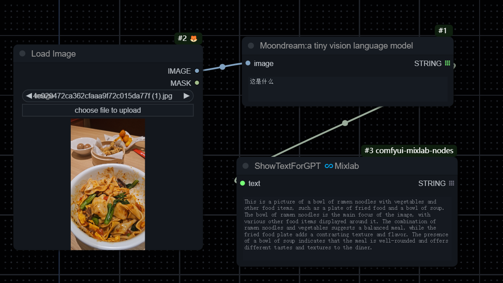

# 🌔 comfyui-moondream

This is a thin wrapper custom node for [moondream](https://github.com/vikhyat/moondream). 

moondream is a tiny vision language model



### Install
Just as other custom nodes:
```
cd ComfyUI/custom_nodes/

git clone https://github.com/shadowcz007/comfyui-moondream.git

../../../python_embeded/python.exe -s -m pip install -r requirements.txt
```

### Download Models
```
../../../python_embeded/python.exe download_models.py

```