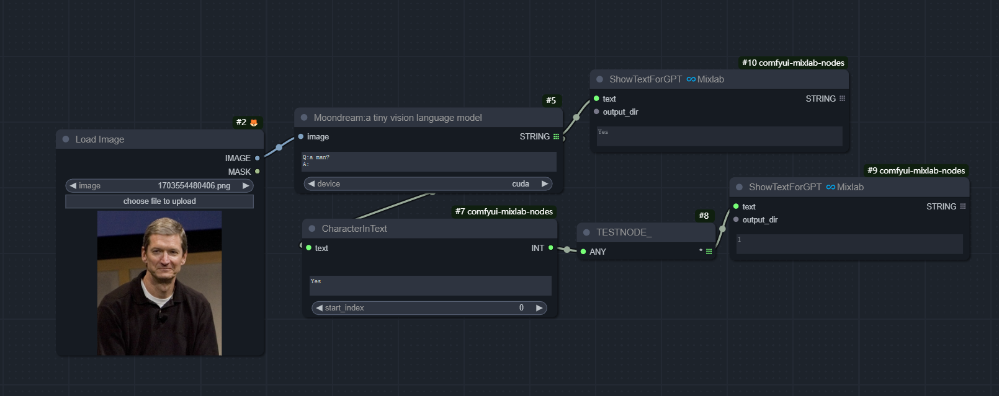
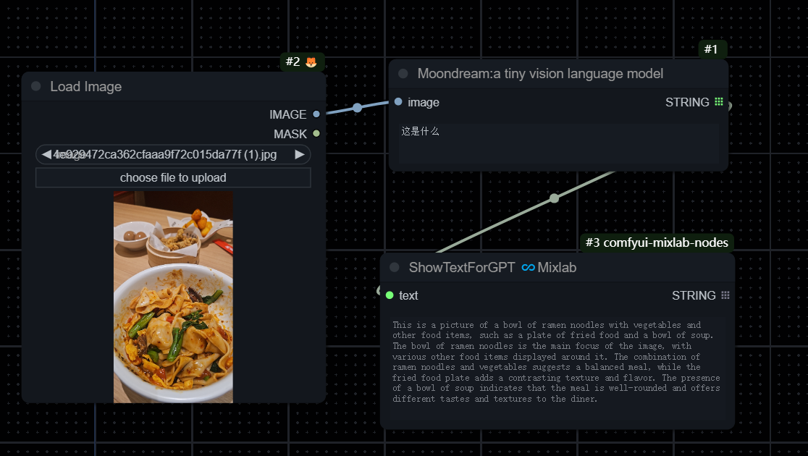

# 🌔 comfyui-moondream

> [寻求帮助 Mixlab nodes discord](https://discord.gg/cXs9vZSqeK)

> [推荐：mixlab-nodes](https://github.com/shadowcz007/comfyui-mixlab-nodes)


This is a thin wrapper custom node for [moondream](https://github.com/vikhyat/moondream). 

moondream is a tiny vision language model





### Install
Just as other custom nodes:
```
cd ComfyUI/custom_nodes/

git clone https://github.com/shadowcz007/comfyui-moondream.git

../../../python_embeded/python.exe -s -m pip install -r requirements.txt
```

### Download Models
```
../../../python_embeded/python.exe download_models.py


```


### 相关插件推荐

[comfyui-liveportrait](https://github.com/shadowcz007/comfyui-liveportrait)

[Comfyui-ChatTTS](https://github.com/shadowcz007/Comfyui-ChatTTS)

[comfyui-sound-lab](https://github.com/shadowcz007/comfyui-sound-lab)

[comfyui-Image-reward](https://github.com/shadowcz007/comfyui-Image-reward)

[comfyui-ultralytics-yolo](https://github.com/shadowcz007/comfyui-ultralytics-yolo)

[comfyui-moondream](https://github.com/shadowcz007/comfyui-moondream)